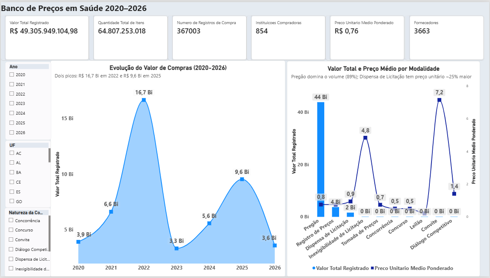
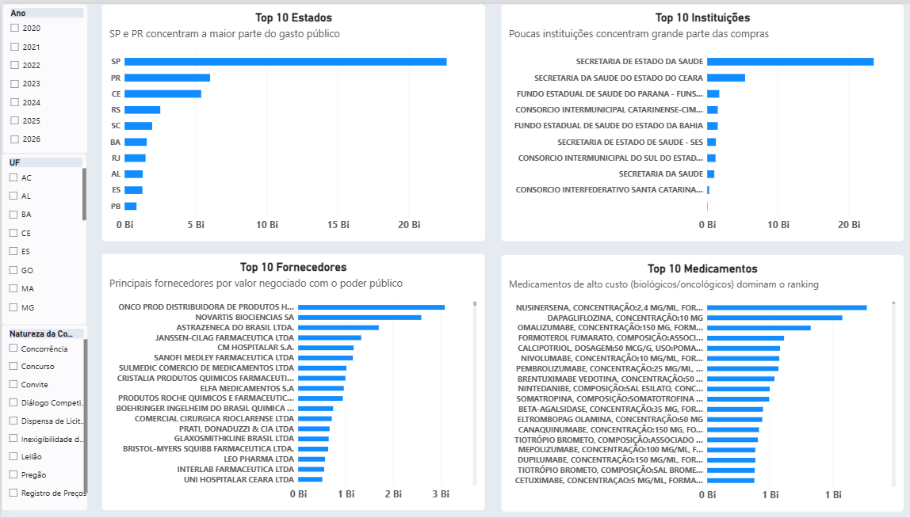
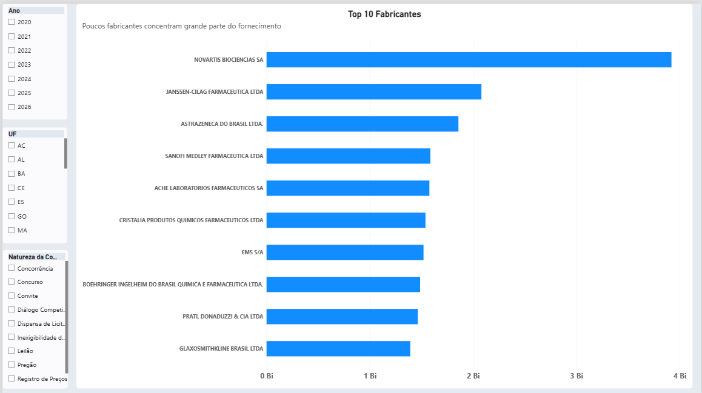

# Projeto BPS — Banco de Preços em Saúde

**Aluno:** Waldinei Lameira Rosa
**Turma:** Visualização de Dados e Business Intelligence — Turma 2 (T2)
**Módulo:** Módulo 2 — Mini-Projeto Avaliativo (Semana 06/07)

## Objetivo do Projeto

Desenvolver um dashboard analítico, em Power BI, para acompanhar as compras
públicas de medicamentos e dispositivos médicos registradas no Banco de Preços
em Saúde (BPS) entre 2020 e 2026, respondendo a seis perguntas de negócio sobre
evolução de valores, concentração geográfica e institucional, produtos e
fornecedores mais relevantes, variação de preços unitários e modalidades de
compra utilizadas.

## Contextualização do Problema

A gestão de compras públicas de medicamentos envolve grande volume financeiro,
múltiplos fornecedores, diferentes modalidades de aquisição e uma ampla
variedade de produtos — o que dificulta o acompanhamento manual e a comparação
de preços entre instituições, estados e períodos. O Banco de Preços em Saúde
(BPS), mantido pelo Ministério da Saúde, disponibiliza publicamente esses
registros de compra, mas em formato bruto, exigindo tratamento e consolidação
antes de gerar informação útil para gestão. Este projeto transforma esses
dados brutos em indicadores e visualizações que apoiam a comparação de preços,
a identificação de padrões de gasto e — como mostrou a investigação da
Pergunta 5 — até a detecção de erros na própria publicação dos dados pela
fonte oficial.

**Importante:** diferenças de preços identificadas neste projeto não devem ser
interpretadas automaticamente como comprovação de economia, sobrepreço ou
irregularidade. As variações podem estar relacionadas a fatores como
fabricante, apresentação, unidade de fornecimento, quantidade adquirida,
localidade, modalidade de compra, período e características específicas da
negociação.

## Fonte dos Dados

Banco de Preços em Saúde (BPS), disponibilizado pelo Ministério da Saúde no
Portal Brasileiro de Dados Abertos:
https://dadosabertos.saude.gov.br/dataset/bps

Dicionário de dados oficial:
https://dadosabertos.saude.gov.br/dataset/bps/resource/0e76f527-5e7e-417d-9d0b-f46d00afb717

## O Dashboard

O dashboard foi desenvolvido em Power BI e está organizado em 3 páginas:

- **Visão Executiva** — 6 cartões de KPI, gráfico de evolução anual do valor total de
  compras (2020–2026) e gráfico combinado (colunas + linha) de Modalidade de Compra
  vs. Preço Médio Ponderado.
- **Rankings & Fornecedores** — 4 gráficos de Top 10: Estados, Instituições,
  Fornecedores e Medicamentos, com slicers sincronizados de Ano, UF e Modalidade.
- **Fabricantes** — Top 10 Fabricantes por valor total, complementando a análise de
  Fornecedores com a perspectiva da indústria produtora.

Arquivo: `dashboard/Projeto_BPS_Waldinei.pbix`

## Vídeo de Apresentação

[PREENCHER: link do vídeo no Loom, com compartilhamento "qualquer pessoa com o link"]

## Perguntas de negócio

Este dashboard foi desenvolvido para responder às seguintes questões:

1. Como o valor total de compras registradas no BPS evoluiu ano a ano (2020–2026)?
2. Quais estados (UF) e instituições concentram o maior volume financeiro de compras?
3. Quais medicamentos e dispositivos médicos (identificados por código CATMAT) têm maior valor total adquirido?
4. Quais fornecedores e fabricantes têm maior participação nos registros de compra?
5. Para um mesmo item (mesmo código CATMAT), como o preço unitário varia entre instituições, estados e períodos?
6. Quais modalidades de compra (licitação, pregão, compra direta, entre outras) são mais utilizadas, e como isso se relaciona com o preço pago?

## Como reproduzir o dataset consolidado

O arquivo `BPS_20_26_Waldinei.csv` não está versionado neste repositório por exceder o limite prático de tamanho do GitHub (~200MB). Para gerá-lo localmente:

1. Baixe os arquivos CSV de 2020 a 2026 em https://dadosabertos.saude.gov.br/dataset/bps e salve-os em `data/raw/`, nomeados como `2020.csv`, `2021.csv`, ..., `2026.csv`.
2. Instale as dependências: `pip install pandas`.
3. Execute o notebook `scripts/preparacao_bps.ipynb` do início ao fim (Run All).
4. O arquivo consolidado será gerado em `data/processed/BPS_20_26_Waldinei.csv`.

## Tratamentos e transformações realizadas

- **Datas** (`dt_compra`, `dt_insercao`): convertidas de texto para datetime. Toda análise temporal do dashboard usa `dt_compra` como referência — `dt_insercao` pode ocorrer anos depois da compra e serve apenas como metadado administrativo.
- **CNPJs**: convertidos para texto com 14 dígitos (zeros à esquerda restaurados, perdidos na leitura original como número).
- **Códigos identificadores** (`co_pdm`, `co_grupo`, `co_classe`, `registro_anvisa`): convertidos para inteiro anulável (`Int64`), eliminando o sufixo `.0` indevido causado por valores nulos.
- **Nulos**: mantidos sem inferência nos campos onde são esperados (ex.: `nu_ata`, presente em apenas 0,66% dos registros, já que a maioria das compras não utiliza ata de registro de preços). Uma exceção investigada: 90 registros sem classificação de PDM/Grupo/Classe são 100% do tipo de compra `ADMINISTRATIVA`, sugerindo que esse tipo de aquisição não passa pela classificação padrão do BPS.
- **Duplicadas**: nenhuma encontrada em nenhum dos 7 anos, nem no dataset consolidado.
- **Consolidação**: os 7 arquivos foram concatenados por empilhamento simples (`pd.concat`), já que a estrutura de colunas é idêntica em todos os anos (ver `docs/discrepancias_anos.md`). Validado que a soma de linhas por ano bate com o total consolidado (367.003 linhas), sem perdas, e que todas as linhas têm `ano_compra` coincidindo com o ano do arquivo de origem.

## Descrição das Principais Colunas Utilizadas

| Coluna | Descrição |
|---|---|
| `dt_compra` | Data da compra — usada como referência para toda análise temporal |
| `dt_insercao` | Data de inserção do registro no sistema (metadado administrativo, pode ocorrer anos após `dt_compra`) |
| `ano_compra` | Ano da compra |
| `ano_arquivo_origem` | Ano do arquivo CSV de origem (coluna adicionada na consolidação, para rastreabilidade) |
| `sg_uf` | Estado (UF) da instituição compradora |
| `cnpj_instituicao` / `no_instituicao` | CNPJ e nome da instituição compradora |
| `cnpj_fornecedor` / `no_fornecedor` | CNPJ e nome do fornecedor/distribuidor |
| `no_fabricante` | Nome do fabricante do medicamento/dispositivo |
| `co_catmat` | Código CATMAT — identificador único do item |
| `ds_item` | Descrição textual do item (medicamento/dispositivo) |
| `vl_preco_unitario` / `vl_preco_total` | Preço unitário e valor total pagos (já corrigidos — ver Pergunta 5) |
| `vl_preco_unitario_bruto` / `vl_preco_total_bruto` | Valores originais, antes da correção do erro sistemático de preço |
| `flag_preco_corrigido` | Sinaliza os registros ajustados na correção de preços da Sprint 5 |
| `qt_medicamento` | Quantidade adquirida |
| `modalidade` | Modalidade de compra/licitação (Pregão, Dispensa de Licitação, etc.) |
| `tp_compra` | Natureza da compra (Administrativa ou Judicial) |
| `nu_ata` | Número da ata de registro de preços, quando aplicável |
| `co_pdm` / `co_grupo` / `co_classe` | Códigos de classificação do item (Padrão Descritivo de Materiais, Grupo, Classe) |
| `registro_anvisa` | Número de registro do produto na ANVISA |

## Resultado da consolidação

- **367.003 linhas**, 37 colunas (36 originais + `ano_arquivo_origem` para rastreabilidade)
- Distribuição por ano: 2020 (84.919) · 2021 (85.007) · 2022 (89.534) · 2023 (33.785) · 2024 (28.745) · 2025 (34.010) · 2026 (11.003 — ano parcial)

## KPIs e métricas do dashboard

| KPI | Fórmula | Observação |
|---|---|---|
| Valor total registrado | Soma de `vl_preco_total` | Soma bruta, sem segmentação — base para os filtros do dashboard |
| Quantidade total de itens comprados | Soma de `qt_medicamento` | Soma bruta entre unidades de medida distintas (comprimido, mililitro, grama etc.) — não deve ser interpretada como itens fisicamente equivalentes entre si |
| Número de registros de compra | Contagem de linhas | Após aplicação dos filtros |
| Instituições compradoras | Contagem distinta de `cnpj_instituicao` | CNPJ usado em vez do nome para evitar inflação por variações de grafia |
| Fornecedores | Contagem distinta de `cnpj_fornecedor` | Mesma lógica acima |
| Preço unitário médio ponderado | `SUM(vl_preco_total) / SUM(qt_medicamento)` | **Nunca calculado como média de `vl_preco_unitario`** — essa abordagem distorceria o resultado ao dar peso igual a compras de tamanhos muito diferentes. Deve ser interpretado com cautela quando os filtros incluírem produtos, unidades de fornecimento ou apresentações distintas. |

## Limitações identificadas

- Um pequeno grupo de registros (31 de 367.003, 0,008% das linhas) concentra 12,3% da quantidade total comprada — em sua maioria medicamentos de alto consumo no SUS, consistentes com compras centralizadas de grande escala. Não há evidência suficiente de erro de digitação para justificar exclusão, mas o preço unitário médio ponderado é sensível a essa concentração (variação de 11% com/sem esses registros).
- 90 registros (0,11%) não possuem classificação de PDM/Grupo/Classe, concentrados 100% no tipo de compra `ADMINISTRATIVA`.
- `dt_insercao` pode ocorrer anos após `dt_compra` (até 6 anos de defasagem observada); toda análise temporal do dashboard usa `dt_compra`.
- O arquivo de 2026 é parcial (cobertura até meados do ano).
- A base do BPS não permite granularidade municipal consistente — a análise geográfica deste projeto foi realizada no nível de estado (UF), não de município.

## Pergunta 1 — Evolução Anual do Valor Total de Compras

| Ano | Valor Total | % do Valor Total | Variação vs. ano anterior |
|---|---:|---:|---:|
| 2020 | R$ 3.929.679.666,48 | 7,97% | — |
| 2021 | R$ 6.629.843.278,67 | 13,44% | +68,73% |
| 2022 | R$ 16.668.364.241,77 | 33,81% | +151,41% |
| 2023 | R$ 3.335.064.693,87 | 6,76% | −79,99% |
| 2024 | R$ 5.591.396.199,32 | 11,34% | +67,67% |
| 2025 | R$ 9.550.129.553,19 | 19,37% | +70,80% |
| 2026* | R$ 3.601.471.471,68 | 7,30% | −62,29% |

\* Ano parcial (cobertura até meados de 2026) — a queda em relação a 2025 não é
diretamente comparável por conta da base de meses incompleta.

**Interpretação:**

- **2022 é o ano de maior valor total por larga margem** (33,8% de todo o período
  acumulado, mais que o dobro de 2021), seguido por uma **queda abrupta de quase 80%
  em 2023**. Esse padrão coincide com a distribuição de registros por ano descrita
  na seção "Resultado da consolidação" (89.534 registros em 2022 contra apenas
  33.785 em 2023) — ou seja, a queda no valor acompanha uma queda proporcional no
  volume de compras, e não uma mudança isolada de preço médio.
- Vale investigar se a queda de 2023–2024 reflete uma redução real de compras
  públicas de medicamentos, ou se é um problema de cobertura/completude dos dados
  do BPS nesses anos específicos. O padrão de recuperação em 2025 (quase voltando
  ao patamar de 2021) sugere que pode ser algo pontual, mas essa é uma hipótese, não
  uma conclusão validada pelos dados disponíveis.

## Pergunta 2 — Estados e Instituições com Maior Volume Financeiro

**Top 5 Estados (UF):**

| UF | Valor Total | % do Valor Total |
|---|---:|---:|
| SP | R$ 22.651.314.321,39 | 45,94% |
| PR | R$ 6.012.891.101,58 | 12,19% |
| CE | R$ 5.386.776.727,30 | 10,92% |
| RS | R$ 2.506.861.045,03 | 5,08% |
| SC | R$ 1.940.563.461,67 | 3,94% |

**Top 5 Instituições:**

| Instituição (CNPJ) | Valor Total | % do Valor Total |
|---|---:|---:|
| Secretaria de Estado da Saúde — Coordenadoria de Assistência Farmacêutica (SP) (46.374.500/0262-31) | R$ 20.054.821.185,04 | 40,68% |
| Secretaria da Saúde do Estado do Ceará (07.954.571/0001-04) | R$ 5.347.707.049,44 | 10,85% |
| Secretaria de Estado da Saúde do Paraná (76.416.866/0001-40) | R$ 2.440.396.821,59 | 4,95% |
| Consórcio Intermunicipal Catarinense — CIMCATARINA (12.075.748/0001-32) | R$ 1.751.900.693,89 | 3,55% |
| Fundo Estadual de Saúde do Paraná — FUNSAUDE (08.597.121/0001-74) | R$ 1.699.810.925,25 | 3,45% |

**Interpretação:**

- **São Paulo concentra quase metade do valor total** (45,94%), praticamente 4x mais
  que o segundo colocado (Paraná, 12,19%). Os Top 10 estados somam 91,05% do valor
  total registrado — uma concentração bastante alta, indicando que a maior parte das
  compras do BPS está concentrada em poucos estados, provavelmente os de maior
  população e rede de saúde.
- **A instituição líder concentra sozinha 40,68% de todo o valor nacional**: a
  Coordenadoria de Assistência Farmacêutica da Secretaria de Estado da Saúde de São
  Paulo, explicando diretamente a liderança do estado de SP no ranking acima.
- **O Paraná aparece duas vezes entre as Top 5 instituições** sob CNPJs diferentes
  (Secretaria de Estado da Saúde e Fundo Estadual de Saúde — FUNSAUDE), somando
  R$ 4,14 bilhões combinados — o que ajuda a explicar por que o estado lidera o
  ranking de UFs com folga sobre o 3º colocado.

**Nota metodológica — inconsistências de nome nos dois sentidos:**

Ao comparar o ranking agrupado por `cnpj_instituicao` (identificador único) com o
mesmo ranking agrupado por `no_instituicao` (nome textual), encontramos evidência dos
dois lados do mesmo problema de qualidade de dados:

1. **Nomes idênticos para instituições diferentes** — São Paulo e Paraná têm CNPJs
   distintos, mas ambos estão cadastrados na fonte simplesmente como
   "SECRETARIA DE ESTADO DA SAUDE", sem identificação do estado. Agrupar por nome
   funde as duas em uma única linha, inflando o resultado (R$ 23,50 bi vs. R$ 20,05 bi
   do maior CNPJ isolado — uma diferença de R$ 3,44 bi).
2. **Nomes diferentes para a mesma instituição** — o Consórcio Intermunicipal
   Catarinense (CNPJ 12.075.748/0001-32) aparece sob duas grafias distintas na fonte
   ("CONSORCIO INTERMUNICIPAL CATARINENSE-CIMCATARINA" e "CONSORCIO INTERFEDERATIVO
   SANTA CATARINA - CINCATARINA"), dividindo o mesmo valor total (R$ 1,75 bi) em duas
   linhas menores quando agrupado por nome.

Esses dois achados, em direções opostas, reforçam a decisão já documentada na seção
"Tratamentos e transformações realizadas" de usar CNPJ (e não nome) como chave de
agrupamento para instituições e fornecedores — qualquer um dos dois erros, sozinho,
já seria suficiente para distorcer um ranking por valor.

## Pergunta 3 — Validação: Agrupamento por CATMAT vs. Descrição

Antes de consolidar o Top 10 de Medicamentos, validamos se agrupar por código CATMAT
(`co_catmat`) produzia resultado diferente de agrupar pela descrição textual (`ds_item`),
já usada no dashboard. Confirmamos que **nenhum CATMAT possui mais de uma descrição
distinta** em todo o dataset (367.003 registros), e o Top 10 por ambos os métodos é
idêntico. Isso valida que o gráfico "Top 10 Medicamentos" do dashboard responde
corretamente à Pergunta 3, sem risco de fragmentação de valor por inconsistência de
cadastro.

## Pergunta 4 — Fornecedores e Fabricantes

**Top 5 Fornecedores** (distribuidores que efetivamente vendem ao poder público, já
no dashboard):

| Fornecedor | Valor Total | % do Valor Total |
|---|---:|---:|
| Onco Prod Distribuidora de Produtos Hospitalares e Oncológicos LTDA. | R$ 3.085.985.128,61 | 6,26% |
| Novartis Biociências SA | R$ 2.592.946.282,22 | 5,26% |
| AstraZeneca do Brasil LTDA. | R$ 1.695.594.121,87 | 3,44% |
| Janssen-Cilag Farmacêutica LTDA | R$ 1.327.448.972,74 | 2,69% |
| CM Hospitalar S.A. | R$ 1.166.753.094,70 | 2,37% |

Além do Top 10 Fornecedores, analisamos separadamente o **Top 10 Fabricantes**
(indústria que produz o medicamento/dispositivo), criado em página nova ("Fabricantes")
do dashboard:

| Fabricante | Valor Total | Registros | % do Valor Total |
|---|---:|---:|---:|
| Novartis Biociências SA | R$ 3.919.206.000 | 4.266 | 7,95% |
| Janssen-Cilag Farmacêutica LTDA | R$ 2.079.847.000 | 865 | 4,22% |
| AstraZeneca do Brasil LTDA. | R$ 1.857.312.000 | 1.622 | 3,77% |
| Sanofi Medley Farmacêutica LTDA | R$ 1.585.869.000 | 4.013 | 3,22% |
| Aché Laboratórios Farmacêuticos SA | R$ 1.576.320.000 | 4.281 | 3,20% |
| Cristália Produtos Químicos Farmacêuticos LTDA | R$ 1.538.333.000 | 22.397 | 3,12% |
| EMS S/A | R$ 1.519.386.000 | 18.438 | 3,08% |
| Boehringer Ingelheim do Brasil Química e Farmacêutica LTDA. | R$ 1.486.342.000 | 2.050 | 3,01% |
| Prati, Donaduzzi & Cia LTDA | R$ 1.463.806.000 | 24.260 | 2,97% |
| GlaxoSmithKline Brasil LTDA | R$ 1.391.008.000 | 1.609 | 2,82% |

**Interpretação:**

- A concentração entre **fornecedores** é bem menor que entre instituições ou
  estados: os Top 5 somam apenas 20,02% do valor total, contra 40,68% de uma única
  instituição na Pergunta 2. Isso reflete um mercado de distribuição mais
  pulverizado — centenas de distribuidoras e laboratórios diferentes competem pelo
  fornecimento.
- **Novartis Biociências aparece tanto entre os fornecedores quanto entre os
  fabricantes** (7,95% do valor como fabricante), o que sugere venda direta ao
  poder público em parte dos casos, sem intermediação de distribuidora.
- Os 10 maiores **fabricantes** concentram 37,35% do valor total — concentração
  moderada, menos extrema que a observada entre instituições e fornecedores.
- **Cristália e Prati-Donaduzzi** aparecem com 5-6x mais registros que a Novartis mas
  valor total similar ou menor, indicando perfil de fabricantes de medicamentos
  genéricos de alto volume e menor preço unitário — perfil de negócio distinto dentro
  do mesmo ranking.

## Pergunta 5 — Variação de Preço Unitário (e Correção de um Erro Sistemático)

Durante a análise de dispersão de preços, identificamos que aproximadamente 57% do
Valor Total Registrado original (R$ 115.063.593.346,89) provinha de registros com
preço unitário anormal — 50x ou mais acima da mediana do próprio item (mesmo código
CATMAT).

**Diagnóstico:** ao comparar com os CSVs brutos da fonte, confirmamos que o erro já está
presente nos dados originais publicados pelo Ministério da Saúde, não foi introduzido no
nosso pipeline de preparação. O padrão identificado (98,9% dos casos concentrados em
fatores de ~100x ou ~1.000x) é consistente com erro sistemático de casa decimal na
publicação da fonte.

**Correção aplicada:** para cada registro com razão de preço/mediana acima de 50x,
dividimos o preço unitário pela potência de 10 correspondente à ordem de grandeza do erro.
Os valores originais foram preservados nas colunas `vl_preco_unitario_bruto` e
`vl_preco_total_bruto`, e uma coluna `flag_preco_corrigido` sinaliza quais dos 367.003
registros foram ajustados (1.812 registros, 0,49% do total em contagem — mas 57% em valor).

**Valor Total corrigido: R$ 49.305.949.104,98** (usado no dashboard a partir desta sprint).

Metodologia completa disponível em `data/scripts/analise_precos_sprint5.ipynb`.

## Pergunta 6 — Modalidade de Compra e Relação com o Preço

O campo `modalidade` (distinto de `tp_compra`, que separa apenas natureza
Administrativa/Judicial) identifica a modalidade de licitação de cada registro de compra.

| Modalidade | Registros | Valor Total | Preço Médio Ponderado | % do Valor Total |
|---|---:|---:|---:|---:|
| Pregão | 332.087 | R$ 43.843.040.000 | R$ 0,7553 | 88,92% |
| Registro de Preços | 18.007 | R$ 3.742.638.000 | R$ 0,7514 | 7,59% |
| Dispensa de Licitação | 13.599 | R$ 1.634.571.000 | R$ 0,9441 | 3,32% |
| Inexigibilidade de Licitação | 417 | R$ 66.140.540 | R$ 4,8392 | 0,13% |
| Tomada de Preços | 1.864 | R$ 10.591.720 | R$ 0,7401 | 0,02% |
| Concorrência | 710 | R$ 3.566.332 | R$ 0,5068 | 0,01% |
| Concurso | 194 | R$ 2.637.446 | R$ 0,4997 | 0,01% |
| Leilão | 54 | R$ 2.002.841 | R$ 0,2179 | 0,00% |
| Convite | 70 | R$ 749.631 | R$ 7,1502 | 0,00% |
| Diálogo Competitivo | 1 | R$ 15.228 | R$ 1,4100 | 0,00% |

**Interpretação:**

- **Pregão domina amplamente** (88,9% do valor total), o que é esperado — é a
  modalidade padrão para compras públicas competitivas no Brasil.
- **Dispensa de Licitação tem preço unitário ~25% maior** que Pregão (R$ 0,9441 vs.
  R$ 0,7553), consistente com a expectativa de que processos menos competitivos
  resultam em preços menos vantajosos para o poder público.
- **Inexigibilidade de Licitação aparece com preço médio ~6,4x maior** que o Pregão.
  Isso não deve ser interpretado como irregularidade: essa modalidade é usada
  legalmente quando existe apenas um fornecedor possível (ex: medicamento
  patenteado/exclusivo), então um preço mais alto pode ser genuíno e justificado
  pela ausência de concorrência real, não necessariamente sobrepreço.

## Achado Adicional — Judicialização da Saúde

Durante a exploração dos dados, identificamos que o campo `tp_compra` (natureza da
compra, distinto de `modalidade`) revela que **7,15% do valor total de compras**
(aproximadamente R$ 3,5 bilhões, após correção de preços da Pergunta 5) é movimentado
por decisão **Judicial**, contra 92,85% por via **Administrativa** normal. Esse é um
indicador relevante de judicialização da saúde no Brasil, tema amplamente debatido
em políticas públicas de saúde, embora não fizesse parte das 6 perguntas de negócio
originais do projeto.

## Recomendações Baseadas nos Dados

- **Padronizar o cadastro de instituições por CNPJ, não por nome**, em sistemas
  públicos de BI — este projeto encontrou instituições diferentes (SP e PR)
  cadastradas com o nome idêntico "SECRETARIA DE ESTADO DA SAUDE", e uma mesma
  instituição (Consórcio Catarinense) grafada de duas formas distintas.
- **Auditar formalmente os registros de Inexigibilidade de Licitação**, não por
  suspeita de irregularidade, mas para documentar a justificativa de
  fornecedor único, já que essa modalidade apresentou preço médio ~6,4x maior
  que o Pregão.
- **Implementar validação automática de ordem de grandeza na publicação dos
  dados do BPS**, já que 57% do valor total original decorria de um erro
  sistemático de casa decimal presente na própria fonte oficial.
- **Utilizar o preço médio ponderado por modalidade** (não só por produto) no
  planejamento de compras via Dispensa de Licitação, que praticou preços ~25%
  acima do Pregão.
- **Monitorar continuamente o indicador de judicialização da saúde** (7,15% do
  valor total de compras), dada sua relevância crescente em política pública.

## Instruções para Reprodução do Projeto

1. Clone este repositório.
2. Baixe os 7 CSVs brutos do BPS (2020–2026) conforme a seção "Como reproduzir o
   dataset consolidado" acima e salve em `data/raw/`.
3. Execute `data/scripts/preparacao_bps.ipynb` para gerar o dataset consolidado.
4. Execute `data/scripts/kpis_bps.ipynb` e `data/scripts/analise_precos_sprint5.ipynb`
   para reproduzir os KPIs e a correção de preços.
5. Abra `dashboard/Projeto_BPS_Waldinei.pbix` no Power BI Desktop (necessário
   instalação prévia) e atualize a fonte de dados apontando para o CSV consolidado
   gerado no passo 3.
